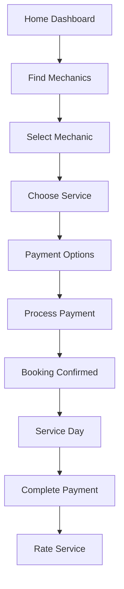

# AutoServe Consumer App - Design System Documentation

A comprehensive design system for the AutoServe mobile-first consumer application, providing mechanics booking services with escrow-protected payments.

## 🎨 Brand Identity & Color Palette

### Primary Brand Colors

The design system is built around a **Trust Blue** theme, emphasizing reliability and professionalism in automotive services.

```css
/* Core Brand Palette */
--brand-sky: hsl(204, 100%, 97%)      /* Light sky background */
--brand-blue: hsl(217, 91%, 60%)      /* Primary blue (Tailwind blue-500) */
--brand-indigo: hsl(239, 84%, 67%)    /* Secondary indigo (Tailwind indigo-500) */
--brand-blue-700: hsl(217, 91%, 50%)  /* Darker blue for hovers */
```

### Semantic Color System

```css
/* Design Token Colors */
--primary: hsl(217, 91%, 60%)         /* Main brand blue */
--primary-foreground: hsl(210, 40%, 98%)
--destructive: hsl(0, 72%, 51%)       /* Error/danger red */
--ring: hsl(217, 91%, 60%)            /* Focus ring color */
--border: hsl(214.3, 31.8%, 91.4%)   /* Subtle borders */
--muted: hsl(210, 40%, 96%)           /* Muted backgrounds */
--muted-foreground: hsl(215.4, 16.3%, 46.9%)
```

### Status Colors

| Status | Color | Usage |
|--------|--------|-------|
| Success | `green-600` | Payment complete, service verified |
| Warning | `yellow-500` | Pending actions, deposits |
| Error | `red-600` | Cancelled bookings, failures |
| Info | `blue-600` | General information, navigation |
| Neutral | `gray-600` | Secondary text, disabled states |

## 🎨 Design Utilities

### Custom Background Classes

```css
/* Primary app background with subtle gradient */
.bg-app-brand {
  background-image: linear-gradient(
    to bottom right,
    hsl(var(--brand-sky)),
    hsl(220 100% 92%),
    hsl(225 100% 90%)
  );
}

/* Brand tile/icon backgrounds */
.tile-brand {
  background-image: linear-gradient(
    to bottom right,
    hsl(199 89% 48%),
    hsl(var(--brand-blue)),
    hsl(var(--brand-indigo))
  );
  color: white;
}

/* Elevated card with backdrop blur */
.card-elevated {
  background-color: hsl(0 0% 100% / 0.92);
  backdrop-filter: blur(8px);
  border: 1px solid hsl(var(--border));
  border-radius: var(--radius);
  box-shadow: 0 6px 20px rgba(30, 64, 175, 0.08);
}
```

## 🔧 Component Design Patterns

### Button Patterns

#### Primary Actions
```tsx
// Main CTAs with brand gradient
className="bg-gradient-to-r from-blue-600 to-indigo-600 hover:from-blue-700 hover:to-indigo-700 text-white py-4 rounded-xl font-semibold shadow-lg hover:shadow-xl transition-all duration-200"
```

#### Secondary Actions
```tsx
// Call/Contact actions
className="bg-gradient-to-r from-green-600 to-emerald-600 hover:from-green-700 hover:to-emerald-700 text-white py-3 rounded-xl"
```

#### Destructive Actions
```tsx
// Cancel/Delete actions
className="border-2 border-red-200 hover:border-red-300 text-red-600 hover:text-red-700 hover:bg-red-50"
```

### Card Components

#### Standard Cards
```tsx
<Card className="card-elevated">
  <CardContent className="p-5">
    {/* Content */}
  </CardContent>
</Card>
```

#### Interactive Cards
```tsx
<Card className="card-elevated cursor-pointer hover:shadow-lg active:scale-[0.98] transition-all duration-200">
```

#### Status Cards
```tsx
// Success/Info cards
<Card className="bg-blue-50/80 border border-blue-200">

// Warning cards  
<Card className="bg-yellow-50/80 border border-yellow-200">

// Error cards
<Card className="bg-red-50/80 border border-red-200">
```

### Icon Containers

#### Brand Icons
```tsx
<div className="w-12 h-12 tile-brand rounded-xl flex items-center justify-center shadow-sm">
  <Icon className="w-6 h-6" />
</div>
```

#### Status Icons
```tsx
// Success
<div className="w-10 h-10 bg-green-100 rounded-lg flex items-center justify-center">
  <CheckCircle className="w-5 h-5 text-green-600" />
</div>

// Info
<div className="w-10 h-10 bg-blue-100 rounded-lg flex items-center justify-center">
  <Info className="w-5 h-5 text-blue-600" />
</div>
```

### Avatar/Profile Images
```tsx
// User avatars with gradient fallback
<div className="w-16 h-16 bg-gradient-to-br from-blue-500 to-indigo-600 rounded-2xl flex items-center justify-center">
  <User className="w-8 h-8 text-white" />
</div>
```

## 📐 Spacing & Layout

### Border Radius Scale
- **sm**: `rounded-lg` (8px) - Small elements, inputs
- **md**: `rounded-xl` (12px) - Cards, buttons
- **lg**: `rounded-2xl` (16px) - Large cards, modals
- **full**: `rounded-full` - Avatars, badges

### Shadow Scale
- **sm**: `shadow-sm` - Subtle elevation
- **md**: `shadow-lg` - Standard cards
- **lg**: `shadow-xl` - Interactive states
- **brand**: `shadow-blue-200` - Brand-colored shadows

### Spacing System
- **xs**: `gap-2` (8px) - Tight spacing
- **sm**: `gap-3` (12px) - Standard spacing
- **md**: `gap-4` (16px) - Section spacing
- **lg**: `gap-6` (24px) - Large sections
- **xl**: `gap-8` (32px) - Page sections

## 🎯 Typography System

### Headings
```tsx
// Page titles
className="text-xl font-bold text-slate-900"

// Section titles  
className="text-lg font-bold text-slate-900"

// Subsection titles
className="font-bold text-slate-900"

// Card titles
className="font-semibold text-slate-900"
```

### Body Text
```tsx
// Primary text
className="text-slate-900"

// Secondary text
className="text-slate-700" 

// Muted text
className="text-gray-600"

// Caption text
className="text-sm text-gray-500"

// Micro text
className="text-xs text-gray-500"
```

### Interactive Text
```tsx
// Links
className="text-blue-600 underline"

// Success states
className="text-green-600 font-semibold"

// Error states  
className="text-red-600 font-medium"
```

## 🎭 Animation & Transitions

### Standard Transitions
```tsx
// Hover states
className="transition-all duration-200"

// Press states
className="active:scale-[0.98] transition-all duration-200"

// Focus states
className="focus:ring-2 focus:ring-blue-500 focus:border-transparent"

// Loading states
className="animate-pulse"

// Smooth scaling
className="hover:scale-105 transition-transform duration-300"
```

### Micro-interactions
```tsx
// Button interactions
className="hover:shadow-xl active:scale-95 transition-all duration-200"

// Card hover
className="hover:shadow-lg transition-shadow duration-200"
```

## 🏗️ Page Layout Patterns

### Mobile-First Structure
```tsx
<div className="min-h-screen bg-app-brand">
  {/* Status Bar Space */}
  <div className="h-11" />
  
  {/* Header */}
  <div className="flex items-center gap-4 px-4 py-4">
    <Button variant="ghost" onClick={router.back}>
      <ArrowLeft className="w-5 h-5" />
    </Button>
    <div className="flex items-center gap-3">
      <div className="w-10 h-10 tile-brand rounded-xl">
        <Icon className="w-5 h-5" />
      </div>
      <h1 className="text-xl font-bold text-slate-900">Title</h1>
    </div>
  </div>
  
  {/* Content */}
  <div className="px-4 pb-24 space-y-4">
    {/* Page content */}
  </div>
  
  {/* Bottom Safe Area */}
  <div className="h-8" />
</div>
```

### Navigation Header Pattern
```tsx
<div className="flex items-center justify-between px-4 py-3">
  <Button variant="ghost" className="w-10 h-10 rounded-lg card-elevated">
    <ArrowLeft className="w-5 h-5" />
  </Button>
  <div className="flex items-center gap-3">
    <div className="w-7 h-7 tile-brand rounded-lg">
      <Icon className="w-4 h-4" />
    </div>
    <h1 className="text-xl font-bold text-slate-900">Page Title</h1>
  </div>
  <div className="w-10" />
</div>
```

## 🎨 Status & State Design

### Payment Status
```tsx
// Pending payment
<div className="bg-yellow-100 text-yellow-800 px-3 py-2 rounded-xl">
  <Clock className="w-4 h-4 mr-2" />
  Payment Pending
</div>

// Deposit paid
<div className="bg-blue-100 text-blue-800 px-3 py-2 rounded-xl">
  <DollarSign className="w-4 h-4 mr-2" />
  Deposit Paid
</div>

// Payment complete
<div className="bg-green-100 text-green-800 px-3 py-2 rounded-xl">
  <CheckCircle className="w-4 h-4 mr-2" />
  Paid in Full
</div>
```

### Service Status
```tsx
// Upcoming
<div className="bg-blue-100 text-blue-800 px-2 py-1 rounded-full text-xs font-semibold">
  Upcoming
</div>

// Completed
<div className="bg-green-100 text-green-800 px-2 py-1 rounded-full text-xs font-semibold">
  Completed
</div>

// Cancelled
<div className="bg-red-100 text-red-800 px-2 py-1 rounded-full text-xs font-semibold">
  Cancelled
</div>
```

## 🔒 Security & Trust Elements

### Escrow Protection
```tsx
<Card className="bg-blue-50/80 border border-blue-200">
  <CardContent className="p-5">
    <div className="flex items-start gap-3">
      <Shield className="w-6 h-6 text-blue-600" />
      <div>
        <h3 className="font-bold text-blue-900 mb-2">Escrow Protection</h3>
        <div className="space-y-2 text-sm text-blue-800">
          <div className="flex items-start gap-2">
            <CheckCircle className="w-4 h-4 text-blue-600 mt-0.5" />
            <span>Payment held securely until service completion</span>
          </div>
        </div>
      </div>
    </div>
  </CardContent>
</Card>
```

### Secure Payment Indicators
```tsx
<div className="flex items-start gap-3">
  <Lock className="w-5 h-5 text-gray-600" />
  <div>
    <h4 className="font-medium text-gray-900">Secure Payment</h4>
    <p className="text-sm text-gray-600">
      Your information is encrypted and secure
    </p>
  </div>
</div>
```

## 📱 Mobile Optimizations

### Touch Targets
- Minimum 44px touch targets for all interactive elements
- Generous padding on buttons: `py-3` or `py-4`
- Adequate spacing between interactive elements

### Typography Scale
- Mobile-optimized font sizes (16px minimum to prevent iOS zoom)
- High contrast ratios for accessibility
- Readable line heights and letter spacing

### Performance
- Backdrop blur effects for modern mobile browsers
- Hardware-accelerated animations with `transform`
- Optimized gradients and shadows

## 🔧 Technical Implementation

### Framework Stack
- **Next.js 15.4.3** - React framework with App Router
- **React 19.1.0** - UI library
- **Tailwind CSS 4** - Utility-first styling
- **Lucide React** - Icon library
- **TypeScript 5** - Type safety

### Key Dependencies
```json
{
  "@radix-ui/react-*": "Latest", // Accessible primitives
  "class-variance-authority": "^0.7.1", // Component variants
  "tailwind-merge": "^3.3.1", // Class merging utility
  "mapbox-gl": "^3.14.0" // Map integration
}
```

### Design System Files
- `src/app/globals.css` - Design tokens and utilities
- `src/components/ui/` - Base UI components  
- `src/components/` - Composite components
- Custom utilities: `bg-app-brand`, `tile-brand`, `card-elevated`

## 🎯 Usage Guidelines

### Do's
✅ Use consistent spacing (multiples of 4px)  
✅ Implement proper hover/focus states  
✅ Follow the established color palette  
✅ Use semantic HTML and ARIA labels  
✅ Test on mobile devices  
✅ Maintain visual hierarchy with typography scale

### Don'ts
❌ Mix different border radius styles inconsistently  
❌ Use colors outside the established palette  
❌ Create buttons smaller than 44px touch targets  
❌ Overuse animations or transitions  
❌ Ignore accessibility guidelines  
❌ Break the established layout patterns

## 🚀 Development Workflow

### Local Development
```bash
npm run dev          # Start development server with Turbopack
npm run build        # Production build
npm run lint         # ESLint checks
```

### Component Creation
1. Follow established patterns from existing components
2. Use TypeScript interfaces for props
3. Implement proper accessibility attributes
4. Add hover/focus states with consistent transitions
5. Test on multiple screen sizes

### Design Token Usage
Always use CSS custom properties and Tailwind utilities rather than hardcoded values:

```tsx
// ✅ Good
className="bg-primary text-primary-foreground"

// ❌ Avoid
style={{backgroundColor: '#3b82f6'}}
```

This design system ensures consistency, accessibility, and maintainability across the entire AutoServe consumer application while providing an excellent user experience for automotive service bookings.

---

## 🗺️ Application Flow & Screen Endpoints

### Main Navigation Structure

The app uses a bottom navigation pattern with 5 primary tabs:

| Tab | Route | Description |
|-----|-------|-------------|
| 🏠 Home | `/` | Dashboard with service overview and quick actions |
| 🔍 Mechanics | `/mechanics` | Search and browse available mechanics |
| 📅 Bookings | `/bookings` | View and manage service bookings |
| 🚗 Vehicles | `/vehicles` | Manage user vehicles and service history |
| 👤 Profile | `/profile` | User profile and account settings |

### Complete Screen Hierarchy

#### 🏠 Home Flow
```
/ (Home Dashboard)
├── /notifications (Notification center)
└── Quick Actions → Navigate to other flows
```

**Features:**
- Personalized greeting with time-based messages
- Upcoming services overview
- Quick action tiles (Find Mechanic, Book Service, etc.)
- Service reminders and alerts

---

#### 🔍 Mechanics Flow
```
/mechanics (Mechanic Search & Browse)
├── /mechanics/[id] (Mechanic Profile)
│   ├── /mechanics/[id]/reviews (Reviews & Ratings)
│   └── → Book Service Flow (/payment/[bookingId])
└── /login?returnTo=/mechanics (Authentication gate)
```

**Features:**
- **Mechanic Search** (`/mechanics`): Filter by location, services, ratings
- **Mechanic Profile** (`/mechanics/[id]`): Detailed mechanic info, services, pricing
- **Reviews** (`/mechanics/[id]/reviews`): Customer reviews and ratings
- **Service Booking**: Leads to payment flow

---

#### 📅 Bookings Flow
```
/bookings (Booking History & Management)
├── /bookings/[id] (Booking Details)
│   ├── → /payment/[bookingId]/complete (Complete Payment)
│   ├── → /reviews/[bookingId]/rate (Rate Service)
│   └── → /receipt/[bookingId] (Download Receipt)
└── Related flows:
    ├── /payment/[bookingId] (Initial Payment)
    ├── /payment/[bookingId]/confirmation (Payment Success)
    └── /payment/[bookingId]/complete (Remaining Payment)
```

**Features:**
- **Booking List** (`/bookings`): All bookings with status filters
- **Booking Details** (`/bookings/[id]`): Complete booking information
- **Payment Management**: Complete remaining payments
- **Service Rating**: Post-service feedback
- **Receipt Generation**: Download payment receipts

---

#### 💳 Payment Flow
```
Service Booking → Payment Options → Payment Processing → Confirmation
/mechanics/[id] → /payment/[bookingId] → /payment/[bookingId]/confirmation
                             ↓
                    (If deposit paid)
/bookings/[id] → /payment/[bookingId]/complete → /payment/[bookingId]/confirmation
```

**Payment Journey:**
1. **Payment Options** (`/payment/[bookingId]`): Choose deposit vs full payment
2. **Payment Processing**: Secure card processing with escrow protection
3. **Confirmation** (`/payment/[bookingId]/confirmation`): Success confirmation
4. **Complete Payment** (`/payment/[bookingId]/complete`): Pay remaining balance

---

#### 🚗 Vehicles Flow
```
/vehicles (Vehicle Management)
├── /vehicles/add (Add New Vehicle)
│   └── /vehicles/add/confirm (Confirm Vehicle Details)
├── /vehicles/[id] (Vehicle Details)
│   ├── /vehicles/[id]/logbook (Service History)
│   └── → Quick Actions to other flows
└── /login?returnTo=/vehicles/add (Authentication for vehicle management)
```

**Features:**
- **Vehicle List** (`/vehicles`): User's registered vehicles
- **Add Vehicle** (`/vehicles/add`): Vehicle registration form
- **Vehicle Confirmation** (`/vehicles/add/confirm`): Verify vehicle details
- **Vehicle Details** (`/vehicles/[id]`): Individual vehicle information
- **Service Logbook** (`/vehicles/[id]/logbook`): Maintenance history

---

#### 👤 Profile Flow
```
/profile (User Profile & Settings)
├── Account Settings
├── Payment Methods
├── Service Preferences
└── Support & Help
```

**Features:**
- User account management
- Payment method configuration
- Service preferences
- Help and support

---

#### 🔔 Notifications Flow
```
/notifications (Notification Center)
├── Service Reminders
├── Booking Updates
├── Payment Notifications
└── → Context-specific actions (Rate service, View booking, etc.)
```

---

#### ⭐ Rating & Reviews Flow
```
/reviews/[bookingId]/rate (Rate Completed Service)
└── → /bookings (Return to bookings after rating)
```

---

#### 🔐 Authentication Flow
```
/login?returnTo=[destination] (Login/Register)
└── → Redirect to original destination
```

**Authentication Gates:**
- Vehicle management requires login
- Mechanic booking requires login
- Profile access requires login

---

### User Journey Flows

#### 🎯 Primary User Journey: Book a Service



**Detailed Flow:**
1. **Discovery**: `/` → `/mechanics` (Browse mechanics)
2. **Selection**: `/mechanics/[id]` (Choose mechanic & service)
3. **Payment**: `/payment/[bookingId]` (Choose payment option)
4. **Confirmation**: `/payment/[bookingId]/confirmation` 
5. **Management**: `/bookings/[id]` (Track booking)
6. **Completion**: `/payment/[bookingId]/complete` (Pay remainder)
7. **Feedback**: `/reviews/[bookingId]/rate` (Rate service)

#### 🔄 Secondary Flows

**Vehicle Management:**
`/vehicles` → `/vehicles/add` → `/vehicles/add/confirm` → `/vehicles/[id]` → `/vehicles/[id]/logbook`

**Booking Management:**
`/bookings` → `/bookings/[id]` → Various actions (payment, rating, receipts)

**Notification Handling:**
`/notifications` → Context-specific actions based on notification type

---

### Route Parameters

| Route Pattern | Parameters | Description |
|---------------|------------|-------------|
| `/mechanics/[id]` | `id`: Mechanic ID | Dynamic mechanic profile |
| `/bookings/[id]` | `id`: Booking ID | Dynamic booking details |
| `/vehicles/[id]` | `id`: Vehicle ID | Dynamic vehicle details |
| `/payment/[bookingId]/*` | `bookingId`: Booking ID | Payment flow for specific booking |
| `/reviews/[bookingId]/rate` | `bookingId`: Booking ID | Rating for specific booking |

### Query Parameters

| Route | Query Params | Usage |
|-------|-------------|--------|
| `/login` | `returnTo`: Redirect URL | Post-login navigation |
| `/vehicles` | `vehicleAdded=true` | Success feedback |
| `/payment/*/confirmation` | `option`, `amount` | Payment type and amount |

---

### Error Handling & Fallbacks

- **404 Routes**: Fallback to home dashboard
- **Authentication Required**: Redirect to `/login?returnTo=[current]`
- **Loading States**: Skeleton screens for all data-dependent pages
- **Network Errors**: Retry mechanisms and offline indicators

This comprehensive flow documentation ensures developers understand the complete user journey and can maintain consistent navigation patterns throughout the application.